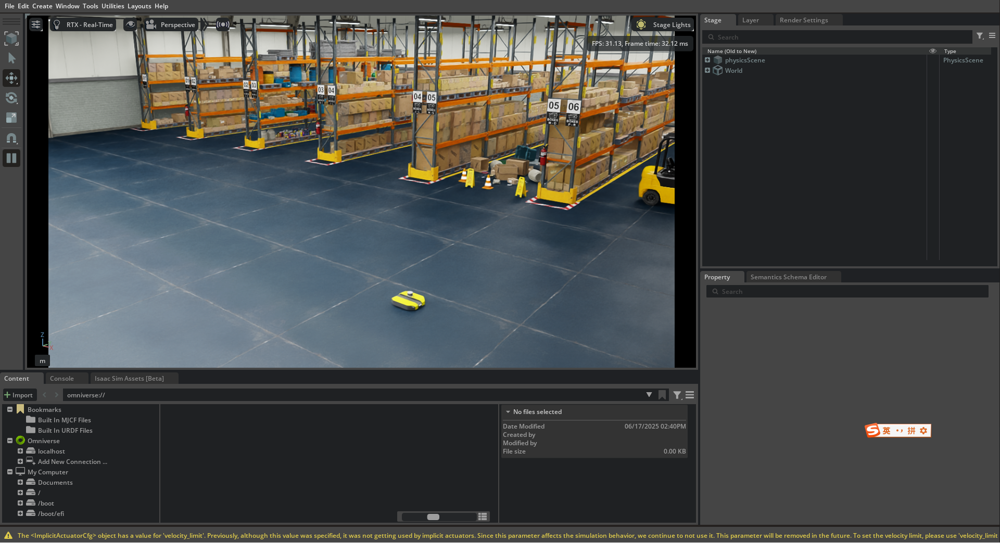

# SAC 初始化env提交
* 

## 启动isaac lab环境
```bash
roslaunch rl_sac_env_isaac_lab lab_control_bt2pro.launch training_mode:=true
```

## 训练
```bash
python3 scripts/z_model_train.py
```

## 验证
```bash
python3 scripts/z_model_eval.py --model_path ./logs/sac_kuavo_navigation/run_20250619_115642/checkpoints/model_ep1500.pth 
```