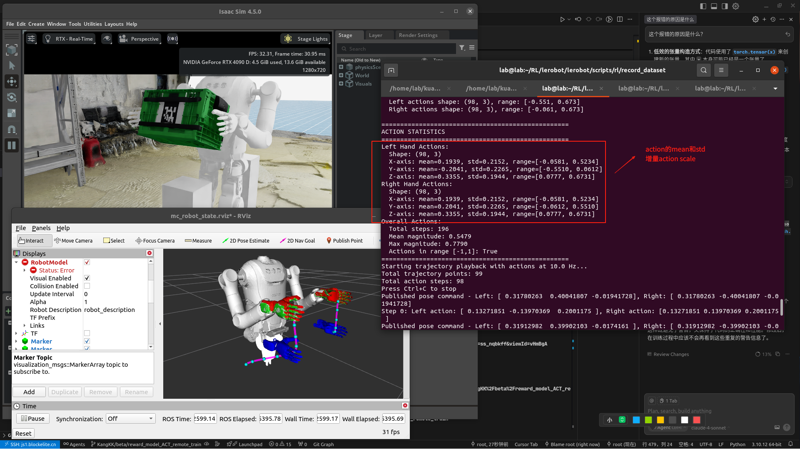
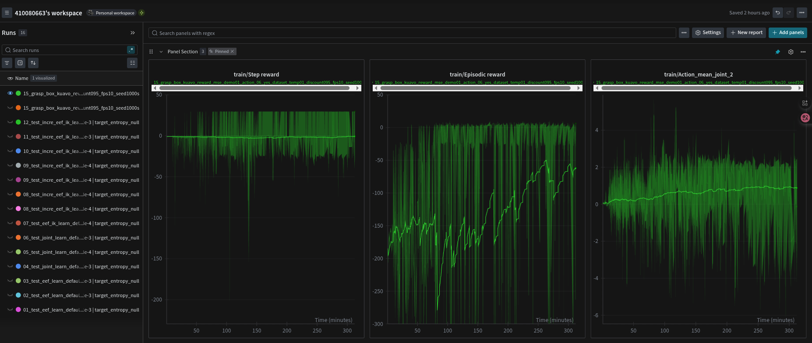
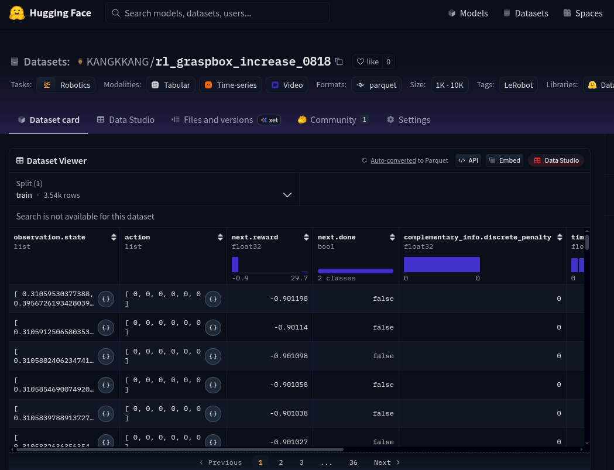

# SAC 初始化env提交
* 

## 启动isaac lab环境
```bash
roslaunch rl_sac_env_isaac_lab lab_control_bt2pro.launch training_mode:=true
```

## 训练
```bash
python3 scripts/z_model_train.py
```

## 验证
```bash
python3 scripts/z_model_eval.py --model_path ./logs/sac_kuavo_navigation/run_20250619_115642/checkpoints/model_ep1500.pth 
```

## 转onnx
```bash
python3 scripts/pth2onnx.py --model_path logs/sac_kuavo_navigation/run_20250619_115642/checkpoints/model_ep1500.pth --output_path logs/sac_kuavo_navigation/run_20250619_115642/onnx/model_ep1500.onnx
```

# lerobo hil-serl
* 
# lerobot hil-serl快速启动教程
## 安装环境 - gym_hil 融合自定义env
```bash
cd /home/lab/RL/lerobot/gym_hil
pip3 install -e .
```
## 测试环境
```bash
# 开启isaac Lab
roslaunch rl_sac_env_isaac_lab lab_control_bt2pro.launch training_mode:=true
# 测试环境
python3 src/rl_sac_env_isaac_lab/test/test_gym_env_isaac_lab.py
```
## 前置处理
### 运行mujoco env环境测试
```bash
python3 lerobot/scripts/rl/gym_manipulator.py --config_path config/Gym_mujoco_env/gym_collect/gym_hil_env_xbox_null.json
```

### 录制专家数据
```bash
python3 lerobot/scripts/rl/gym_manipulator.py --config_path config/Gym_mujoco_env/gym_collect/gym_hil_env_xbox_record.json
```

## 开始训练
### 开启actor网络
```bash
python3 lerobot/scripts/rl/actor.py --config_path config/Gym_mujoco_env/train/train_gym_hil_env_xbox.json
``` 

### 开启Critic网络，同时打开mujoco环境和加载wandb
```bash
python3 lerobot/scripts/rl/learner.py --config_path config/Gym_mujoco_env/train/train_gym_hil_env_xbox.json 
```

## 验证/推理网络
* 注意json当中的`pretrained_policy_name_or_path`和`mode`字段
```bash
python3 lerobot/scripts/rl/gym_manipulator.py --config_path config/Gym_mujoco_env/eval/gym_hil_env_xbox_eval.json
```

## 获取record数据当中的关于obs的min和max
* 查看`lerobot/config/demo_get_obs_maxmin.sql`当中的语句，在hugging Face当中创建好自己的dataset，然后上传上去
* 
* 因为huggingFace使用DuckDB 管理数据，所以需要如下sql语句
```sql
"""
SELECT
    MIN("observation.state"[1]) AS min_dim_1, MAX("observation.state"[1]) AS max_dim_1,
    MIN("observation.state"[2]) AS min_dim_2, MAX("observation.state"[2]) AS max_dim_2,
    MIN("observation.state"[3]) AS min_dim_3, MAX("observation.state"[3]) AS max_dim_3,
    MIN("observation.state"[4]) AS min_dim_4, MAX("observation.state"[4]) AS max_dim_4,
    MIN("observation.state"[5]) AS min_dim_5, MAX("observation.state"[5]) AS max_dim_5,
    MIN("observation.state"[6]) AS min_dim_6, MAX("observation.state"[6]) AS max_dim_6,
    MIN("observation.state"[7]) AS min_dim_7, MAX("observation.state"[7]) AS max_dim_7,
    MIN("observation.state"[8]) AS min_dim_8, MAX("observation.state"[8]) AS max_dim_8,
    MIN("observation.state"[9]) AS min_dim_9, MAX("observation.state"[9]) AS max_dim_9,
    MIN("observation.state"[10]) AS min_dim_10, MAX("observation.state"[10]) AS max_dim_10,
    MIN("observation.state"[11]) AS min_dim_11, MAX("observation.state"[11]) AS max_dim_11,
    MIN("observation.state"[12]) AS min_dim_12, MAX("observation.state"[12]) AS max_dim_12,
    MIN("observation.state"[13]) AS min_dim_13, MAX("observation.state"[13]) AS max_dim_13,
    MIN("observation.state"[14]) AS min_dim_14, MAX("observation.state"[14]) AS max_dim_14,
    MIN("observation.state"[15]) AS min_dim_15, MAX("observation.state"[15]) AS max_dim_15,
    MIN("observation.state"[16]) AS min_dim_16, MAX("observation.state"[16]) AS max_dim_16,
    MIN("observation.state"[17]) AS min_dim_17, MAX("observation.state"[17]) AS max_dim_17,
    MIN("observation.state"[18]) AS min_dim_18, MAX("observation.state"[18]) AS max_dim_18,
    MIN("observation.state"[19]) AS min_dim_19, MAX("observation.state"[19]) AS max_dim_19,
    MIN("observation.state"[20]) AS min_dim_20, MAX("observation.state"[20]) AS max_dim_20,
    MIN("observation.state"[21]) AS min_dim_21, MAX("observation.state"[21]) AS max_dim_21
FROM train;
"""
SELECT
    MIN("observation.state"[1]) AS min_dim_1,
    MIN("observation.state"[2]) AS min_dim_2,
    MIN("observation.state"[3]) AS min_dim_3,
    MIN("observation.state"[4]) AS min_dim_4,
    MIN("observation.state"[5]) AS min_dim_5,
    MIN("observation.state"[6]) AS min_dim_6,
    MIN("observation.state"[7]) AS min_dim_7,
    MIN("observation.state"[8]) AS min_dim_8,
    MIN("observation.state"[9]) AS min_dim_9,
    MIN("observation.state"[10]) AS min_dim_10,
    MIN("observation.state"[11]) AS min_dim_11,
    MIN("observation.state"[12]) AS min_dim_12,
    MIN("observation.state"[13]) AS min_dim_13,
    MIN("observation.state"[14]) AS min_dim_14,
    MIN("observation.state"[15]) AS min_dim_15,
    MIN("observation.state"[16]) AS min_dim_16,
    MIN("observation.state"[17]) AS min_dim_17,
    MIN("observation.state"[18]) AS min_dim_18,
    MIN("observation.state"[19]) AS min_dim_19,
    MIN("observation.state"[20]) AS min_dim_20,
    MIN("observation.state"[21]) AS min_dim_21,
    MAX("observation.state"[1]) AS max_dim_1,
    MAX("observation.state"[2]) AS max_dim_2,
    MAX("observation.state"[3]) AS max_dim_3,
    MAX("observation.state"[4]) AS max_dim_4,
    MAX("observation.state"[5]) AS max_dim_5,
    MAX("observation.state"[6]) AS max_dim_6,
    MAX("observation.state"[7]) AS max_dim_7,
    MAX("observation.state"[8]) AS max_dim_8,
    MAX("observation.state"[9]) AS max_dim_9,
    MAX("observation.state"[10]) AS max_dim_10,
    MAX("observation.state"[11]) AS max_dim_11,
    MAX("observation.state"[12]) AS max_dim_12,
    MAX("observation.state"[13]) AS max_dim_13,
    MAX("observation.state"[14]) AS max_dim_14,
    MAX("observation.state"[15]) AS max_dim_15,
    MAX("observation.state"[16]) AS max_dim_16,
    MAX("observation.state"[17]) AS max_dim_17,
    MAX("observation.state"[18]) AS max_dim_18,
    MAX("observation.state"[19]) AS max_dim_19,
    MAX("observation.state"[20]) AS max_dim_20,
    MAX("observation.state"[21]) AS max_dim_21
FROM train
```

# Kuavo RL RLPD Hil-Serl
```bash
cd lerobot
pip3 install -e .
```
* RL 为了dataset buffer 还是得(RL仓库环境) - lerobot_rl rl环境组合
- pip3 install torch torchvision --index-url https://download.pytorch.org/whl/cu128 --force-reinstall
- pip install torchcodec --index-url=https://download.pytorch.org/whl/cu128
- conda install ffmpeg -c conda-forge
```bash
nvblox_torch                   0.0.post1.dev15
torch                          2.8.0+cu128
torchaudio                     2.8.0+cu128
torchcodec                     0.6.0+cu128
torchvision                    0.23.0+cu128
```
## 2025/8/19 - agent实现
* 目前agent学会如何在固定基下，双手靠近箱子 + 搬运固定位置和朝向的箱子
* 开发分支
    * RL 分支 ： KangKK/dev/default_joint_space_test_0726 (3d1b50cb7366e0440d712ae4c3c2973805949c0b)
    * 机器人isaac sim env分支： KangKK/fix/merge_kmpc_for_rlpd(6f90ce465e602e9cfbc9da4add695d8ccd3ebb35)
* train config
    * 1) 通过原子策略干预录制，预先采集30条专家transition数据存入到off-line buffer当中
        *  
    * 2) 后续在on-line learning的过程中不再进行干预，而是由agent自行探索将经验存放到replay buffer当中，训练曲线如下，可以看到后期reward逐步上涨，一次成功的回合的总reward为2到3左右
        *  

### reward设计如下：
根据代码中的奖励设计，我可以将其总结为以下的LaTeX公式：

$$R = \alpha \cdot \text{scale} \cdot \left( w_{\text{hand}} \cdot \text{MSE}{\text{hand}} + w{\text{box}} \cdot \text{MSE}{\text{box}} + \text{bonus} \right)$$
其中各个组件的详细定义为：
$$\text{MSE}{\text{hand}} = -\left( \text{MSE}{\text{left}} + \text{MSE}{\text{right}} \right)$$
$$\text{MSE}{\text{left}} = \frac{1}{3}\sum{i=0}^{2}(p_{\text{left},i}^{\text{current}} - p_{\text{left},i}^{\text{target}})^2$$
$$\text{MSE}{\text{right}} = \frac{1}{3}\sum{i=0}^{2}(p_{\text{right},i}^{\text{current}} - p_{\text{right},i}^{\text{target}})^2$$
$$\text{MSE}{\text{box}} = -\frac{1}{3}\sum{i=0}^{2}(p_{\text{box},i}^{\text{current}} - p_{\text{box},i}^{\text{target}})^2$$
$$\text{bonus} = \begin{cases} 
+3.0 & \text{if } z_{\text{box}}^{\text{current}} > z_{\text{box}}^{\text{target}} \text{ (success)} \\
-1.0 & \text{if } z_{\text{box}}^{\text{current}} < 0.20 \text{ (failure)} \\
0 & \text{otherwise}
\end{cases}$$

参数说明：
- $w_{\text{hand}}$ = `hand_reward_weight`（手部位置权重）
- $w_{\text{box}}$ = `box_reward_weight`（箱子位置权重）
- $\alpha$ = `reward_scale` = 10.0（奖励缩放因子）
- $p^{\text{current}}$：当前位置
- $p^{\text{target}}$：目标位置

设计原理：通过设置 $w_{\text{box}} > w_{\text{hand}}$，使得智能体优先关注箱子的移动而非手部精确定位。

### 推理实时演示视频
* 进issue查看

## 录制huggingface dataset - 专家transition
* 
### 1）启动机器人及环境
* KangKK/fix/merge_kmpc_for_rlpd
* 6f90ce465e602e9cfbc9da4add695d8ccd3ebb35
```bash
cd /home/lab/kuavo-ros-control
roslaunch isaac_sim isaac_lab_nodelet_no_tcp.launch
roslaunch motion_capture_ik ik_node.launch
```
### 2）可以通过record_dataset 通过工具模拟MetaVR的发布节点，并且同时发布贝塞尔轨迹的信息
* 重点关于`/home/lab/RL/lerobot/lerobot/scripts/rl/record_dataset/key_point.json`的定义，关于抓取的关键帧率
* 每个绝对式下的贝塞尔轨迹点之间的增量都会回放到[-1, 1]，INCREMENT_SCALE = 0.01，即 action[-1,1] * 0.01 = ±0.01m的增量范围
* 同时发布话题为`/sac/kuavo_eef_action_scale_left` 和 `/sac/kuavo_eef_action_scale_right`
* 脚本使用指南：先按1+回车开始发布meta fake话题，然后按2+回车决定是否开始干预，3+回车是开始执行贝塞尔专家演示数据
```bash
conda activate lerobot_rl
cd /home/lab/RL/lerobot/lerobot/scripts/rl/record_dataset
python3 joystick_simulator.py

# lab @ lab in ~/RL/lerobot/lerobot/scripts/rl/record_dataset on git:KangKK/dev/default_joint_space_test_0726 x [14:03:36] 
$ python3 joystick_simulator.py                                                                                                            
Meta VR Joystick Simulator
========================================
ROS joystick simulator initialized successfully
Meta VR Joystick Simulator
Simulates Quest3 controller for testing intervention functionality

============================================================
META VR JOYSTICK SIMULATOR - MAIN MENU
============================================================
1. Start/Stop Publishing Joystick Data
2. Toggle Intervention (Right Grip)
3. Start Bézier Trajectory Tool
4. Stop Bézier Trajectory Tool
5. Trigger Episode Success
6. Trigger Episode Failure
7. Show Status
8. Quick Start (Publishing + Bézier Tool)
9. Quick Stop (Stop All)
0. Exit
============================================================

Enter your choice (0-9):
```
### 3） 开始录制
```bash
conda activate lerobot_rl
python3 lerobot/scripts/rl/gym_manipulator.py --config_path config/Isaac_lab_kuavo_env/gym_env/eef_gym_hil_env_meta_obs_32_action_06_record.json
```

## on-line learning阶段
### 1）启动机器人env环境
* 和上一步一样省略
### 2）开始学习
* 请注意，因为代码当中我把cv_image(224 x 224)都进行了赋0操作，所以录制出来的lerobotdataset其实都是0的黑色图像
```bash
# actor启动
python3 lerobot/scripts/rl/actor.py --config_path config/Isaac_lab_kuavo_env/train/only_on_line_learning/eef_obs_32_action_06_yes_dataset_grasp.json

# learner启动
python3 lerobot/scripts/rl/learner.py --config_path config/Isaac_lab_kuavo_env/train/only_on_line_learning/eef_obs_32_action_06_yes_dataset_grasp.json
```

## 下一步计划
* 使用行为克隆的学习方式先初始化actor网络，看是否会比现在训练5小时出效果的收敛时间更短
* 引入不同朝向的箱子进行搬运
* 开放浮动基的躯干控制