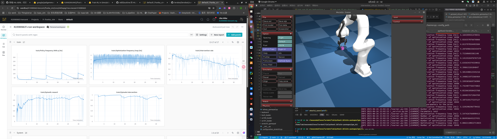
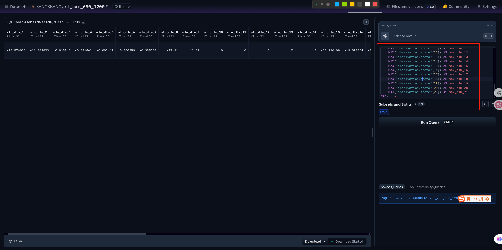

# SAC 初始化env提交
* 

## 启动isaac lab环境
```bash
roslaunch rl_sac_env_isaac_lab lab_control_bt2pro.launch training_mode:=true
```

## 训练
```bash
python3 scripts/z_model_train.py
```

## 验证
```bash
python3 scripts/z_model_eval.py --model_path ./logs/sac_kuavo_navigation/run_20250619_115642/checkpoints/model_ep1500.pth 
```

## 转onnx
```bash
python3 scripts/pth2onnx.py --model_path logs/sac_kuavo_navigation/run_20250619_115642/checkpoints/model_ep1500.pth --output_path logs/sac_kuavo_navigation/run_20250619_115642/onnx/model_ep1500.onnx
```

# lerobo hil-serl
* 
# lerobot hil-serl快速启动教程
## 安装环境 - gym_hil 融合自定义env
```bash
cd /home/lab/RL/lerobot/gym_hil
pip3 install -e .
```
## 测试环境
```bash
# 开启isaac Lab
roslaunch rl_sac_env_isaac_lab lab_control_bt2pro.launch training_mode:=true
# 测试环境
python3 src/rl_sac_env_isaac_lab/test/test_gym_env_isaac_lab.py
```
## 前置处理
### 运行mujoco env环境测试
```bash
python3 lerobot/scripts/rl/gym_manipulator.py --config_path config/Gym_mujoco_env/gym_collect/gym_hil_env_xbox_null.json
```

### 录制专家数据
```bash
python3 lerobot/scripts/rl/gym_manipulator.py --config_path config/Gym_mujoco_env/gym_collect/gym_hil_env_xbox_record.json
```

## 开始训练
### 开启actor网络
```bash
python3 lerobot/scripts/rl/actor.py --config_path config/Gym_mujoco_env/train/train_gym_hil_env_xbox.json
``` 

### 开启Critic网络，同时打开mujoco环境和加载wandb
```bash
python3 lerobot/scripts/rl/learner.py --config_path config/Gym_mujoco_env/train/train_gym_hil_env_xbox.json 
```

## 验证/推理网络
* 注意json当中的`pretrained_policy_name_or_path`和`mode`字段
```bash
python3 lerobot/scripts/rl/gym_manipulator.py --config_path config/Gym_mujoco_env/eval/gym_hil_env_xbox_eval.json
```

## 获取record数据当中的关于obs的min和max
* 查看`lerobot/config/demo_get_obs_maxmin.sql`当中的语句，在hugging Face当中创建好自己的dataset，然后上传上去
* 
* 因为huggingFace使用DuckDB 管理数据，所以需要如下sql语句
```sql
"""
SELECT
    MIN("observation.state"[1]) AS min_dim_1, MAX("observation.state"[1]) AS max_dim_1,
    MIN("observation.state"[2]) AS min_dim_2, MAX("observation.state"[2]) AS max_dim_2,
    MIN("observation.state"[3]) AS min_dim_3, MAX("observation.state"[3]) AS max_dim_3,
    MIN("observation.state"[4]) AS min_dim_4, MAX("observation.state"[4]) AS max_dim_4,
    MIN("observation.state"[5]) AS min_dim_5, MAX("observation.state"[5]) AS max_dim_5,
    MIN("observation.state"[6]) AS min_dim_6, MAX("observation.state"[6]) AS max_dim_6,
    MIN("observation.state"[7]) AS min_dim_7, MAX("observation.state"[7]) AS max_dim_7,
    MIN("observation.state"[8]) AS min_dim_8, MAX("observation.state"[8]) AS max_dim_8,
    MIN("observation.state"[9]) AS min_dim_9, MAX("observation.state"[9]) AS max_dim_9,
    MIN("observation.state"[10]) AS min_dim_10, MAX("observation.state"[10]) AS max_dim_10,
    MIN("observation.state"[11]) AS min_dim_11, MAX("observation.state"[11]) AS max_dim_11,
    MIN("observation.state"[12]) AS min_dim_12, MAX("observation.state"[12]) AS max_dim_12,
    MIN("observation.state"[13]) AS min_dim_13, MAX("observation.state"[13]) AS max_dim_13,
    MIN("observation.state"[14]) AS min_dim_14, MAX("observation.state"[14]) AS max_dim_14,
    MIN("observation.state"[15]) AS min_dim_15, MAX("observation.state"[15]) AS max_dim_15,
    MIN("observation.state"[16]) AS min_dim_16, MAX("observation.state"[16]) AS max_dim_16,
    MIN("observation.state"[17]) AS min_dim_17, MAX("observation.state"[17]) AS max_dim_17,
    MIN("observation.state"[18]) AS min_dim_18, MAX("observation.state"[18]) AS max_dim_18,
    MIN("observation.state"[19]) AS min_dim_19, MAX("observation.state"[19]) AS max_dim_19,
    MIN("observation.state"[20]) AS min_dim_20, MAX("observation.state"[20]) AS max_dim_20,
    MIN("observation.state"[21]) AS min_dim_21, MAX("observation.state"[21]) AS max_dim_21
FROM train;
"""
SELECT
    MIN("observation.state"[1]) AS min_dim_1,
    MIN("observation.state"[2]) AS min_dim_2,
    MIN("observation.state"[3]) AS min_dim_3,
    MIN("observation.state"[4]) AS min_dim_4,
    MIN("observation.state"[5]) AS min_dim_5,
    MIN("observation.state"[6]) AS min_dim_6,
    MIN("observation.state"[7]) AS min_dim_7,
    MIN("observation.state"[8]) AS min_dim_8,
    MIN("observation.state"[9]) AS min_dim_9,
    MIN("observation.state"[10]) AS min_dim_10,
    MIN("observation.state"[11]) AS min_dim_11,
    MIN("observation.state"[12]) AS min_dim_12,
    MIN("observation.state"[13]) AS min_dim_13,
    MIN("observation.state"[14]) AS min_dim_14,
    MIN("observation.state"[15]) AS min_dim_15,
    MIN("observation.state"[16]) AS min_dim_16,
    MIN("observation.state"[17]) AS min_dim_17,
    MIN("observation.state"[18]) AS min_dim_18,
    MIN("observation.state"[19]) AS min_dim_19,
    MIN("observation.state"[20]) AS min_dim_20,
    MIN("observation.state"[21]) AS min_dim_21,
    MAX("observation.state"[1]) AS max_dim_1,
    MAX("observation.state"[2]) AS max_dim_2,
    MAX("observation.state"[3]) AS max_dim_3,
    MAX("observation.state"[4]) AS max_dim_4,
    MAX("observation.state"[5]) AS max_dim_5,
    MAX("observation.state"[6]) AS max_dim_6,
    MAX("observation.state"[7]) AS max_dim_7,
    MAX("observation.state"[8]) AS max_dim_8,
    MAX("observation.state"[9]) AS max_dim_9,
    MAX("observation.state"[10]) AS max_dim_10,
    MAX("observation.state"[11]) AS max_dim_11,
    MAX("observation.state"[12]) AS max_dim_12,
    MAX("observation.state"[13]) AS max_dim_13,
    MAX("observation.state"[14]) AS max_dim_14,
    MAX("observation.state"[15]) AS max_dim_15,
    MAX("observation.state"[16]) AS max_dim_16,
    MAX("observation.state"[17]) AS max_dim_17,
    MAX("observation.state"[18]) AS max_dim_18,
    MAX("observation.state"[19]) AS max_dim_19,
    MAX("observation.state"[20]) AS max_dim_20,
    MAX("observation.state"[21]) AS max_dim_21
FROM train
```

### Kuavo_env RLPD
```bash
~/kuavo-ros-control
git:KangKK/fix/merge_kmpc_for_rlpd 
实物nmpc全身和kmpc运动学：

roslaunch humanoid_controllers load_kuavo_isaac_lab.launch joystick_type:=bt2pro with_mm_ik:=false only_half_up_body:=true

roslaunch motion_capture_ik kinematic_mpc_vr_incremental.launch ip_address:=10.10.20.198 visualize:=1 enable_head_control:=false if_use_vr_meta_for_hil_data:=false

python3 lerobot/scripts/rl/actor.py --config_path config/Isaac_lab_kuavo_env/train/only_on_line_learning/train_gym_hil_env_meta_obs_32_no_vision.json

python3 lerobot/scripts/rl/learner.py --config_path config/Isaac_lab_kuavo_env/train/only_on_line_learning/train_gym_hil_env_meta_obs_32_no_vision.json
```